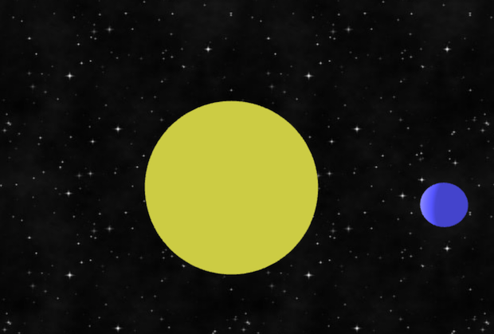

solar-webgl
===========

A simple WebGL experiment. A planet turning around a sun. Use keyboard and mouse control to zoom, pan and tilt.



## Play online

[Demo](https://play.sugoi.be/solar/)

## Install

```
$ npm install
```

To run directly in your browser:
```
$ gulp dev
```

To build the project to the `dist` folder:
```
$ gulp dist
```

Uses [Three.js](https://threejs.org/) to handle the controls.

